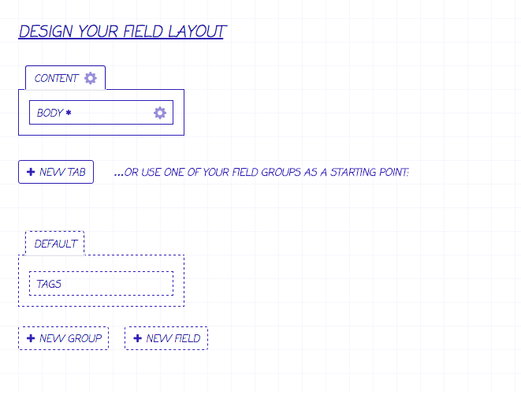
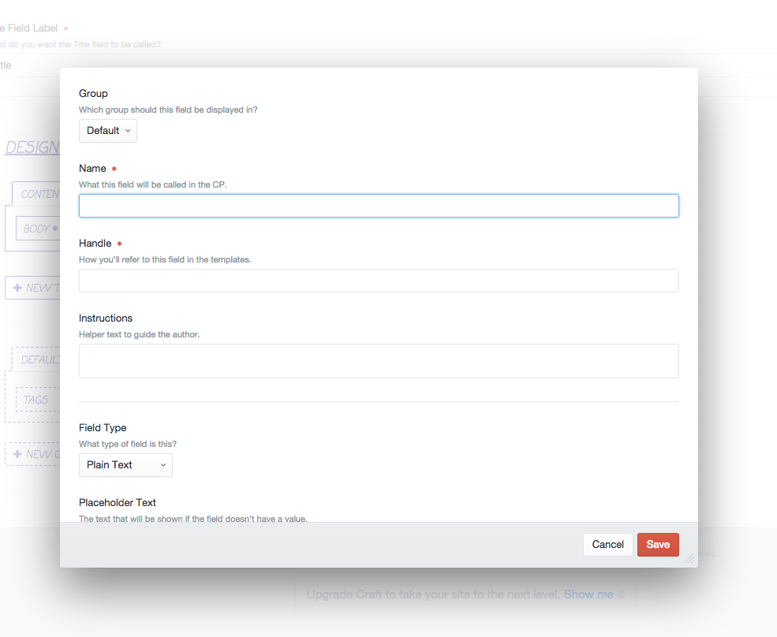

# Quick Fields for Craft

Ever been creating a field layout for an entry type and realise you forgot to create one field? This plugin adds buttons
to the field layout that allow you to quickly create fields and field groups on the same page.

## Screenshots

## Changelog

### v0.2.0
- Implemented much better error reporting when saving fields ([\#1](https://github.com/benjamminf/craft-quick-field/issues/1))
- Fixed issue with duplicate HTML id's ([\#2](https://github.com/benjamminf/craft-quick-field/issues/2))

### v0.1.1
- Added documentation links

### v0.1.0
- Initial release
